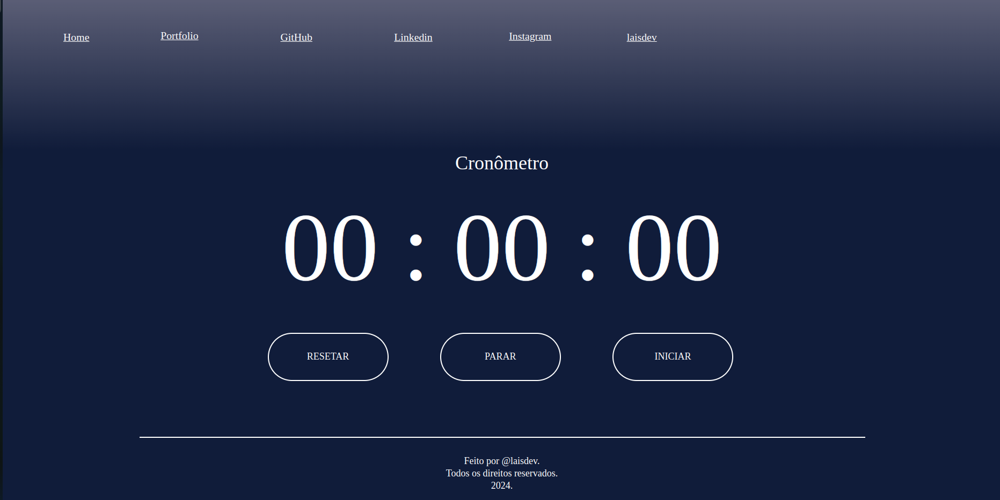

# stopwatch  

## Apresentação:  
Intuito de fazer um cronômetro simples, usando algumas linguagens web, a fim de praticar os conhecimentos adquiridos nas linguagens e poder contribuir com minha comunidade.  
  
## Linguagens utilizadas:  
- HTML  
- CSS  
- JavaScript  

## Nivel de experiência:  
Inicialmente, 0% em todas, porém com o tempo fui aprendendo e fazendo modificações no proprio arquivo.  
  
## Materiais de apoio:  
- Slides que meu professor disponibilizou
- Todo o codigo javascript foi inspirado em:  
  [HACK CLUB](https://brasil.hackclub.com/workshops/cronometro/)
- O CSS foi criado usando a ferramenta FIGMA, porém foi feita algumas modificações/ajustes com base no que ja havia aprendido.
